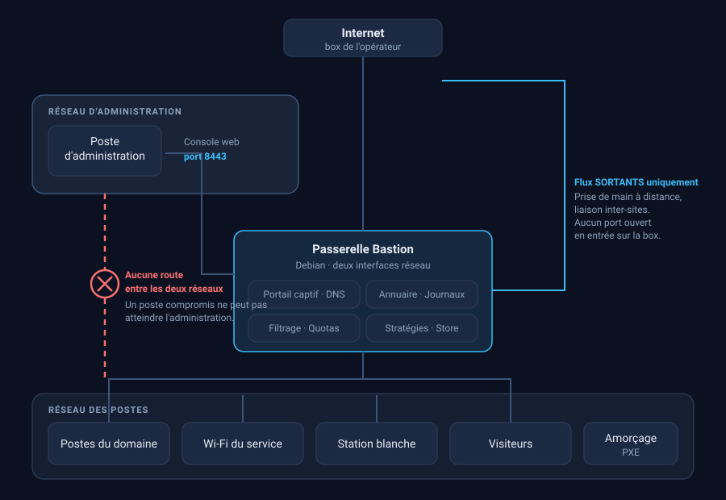

<div align="center">

# 🛡️ Bastion

**Contrôleur d'accès réseau pour un parc qui n'est *pas* raccordé au réseau de l'administration.**

Portail captif · Annuaire · Filtrage · Journalisation légale · Administration des postes
— sur une seule passerelle Debian.

</div>

---

Bastion réunit ce qu'un service isolé doit assurer lui-même : authentifier les agents,
filtrer les accès, journaliser ce que la loi impose de conserver, et administrer les postes
du domaine. Sans dépendre d'une infrastructure extérieure ni d'un service en ligne.

Le moteur réseau n'est pas réécrit : Bastion **orchestre** des briques éprouvées — OpenNDS,
FreeRADIUS, dnsmasq, Samba AD, nftables — et y ajoute la console, les stratégies et les
garde-fous qui manquent quand on les assemble à la main.

## Architecture

<div align="center">
  
</div>

Le choix structurant est la **coupure au centre** : aucune route ne relie le réseau
d'administration à celui des postes. Un poste compromis ne peut pas atteindre la console.

C'est pourquoi tout ce qui doit traverser passe par des flux **sortants** — la prise de main
à distance comme la liaison inter-sites : les deux extrémités se connectent vers la
passerelle, et aucun port n'est ouvert en entrée sur la box.

## Ce qu'il fait

| | |
|---|---|
| **Portail captif** | Aucun accès sans authentification. Comptes nominatifs, bons visiteurs à durée limitée, quotas, débits et plages horaires par groupe. |
| **Annuaire &amp; postes** | Contrôleur de domaine intégré : ouverture de session Windows, stratégies de groupe, dossiers partagés, inventaire du parc. |
| **Store d'applications** | Déploiement silencieux de logiciels sur les postes, avec catalogue de 90 sources résolues à la volée. |
| **Filtrage** | Blocage par catégories et par domaines, au niveau DNS — donc valable pour tous les navigateurs, sans rien installer sur les postes. |
| **Journalisation légale** | Traces chaînées et scellées par signature, purge automatique au terme de la durée de conservation, extraction sur réquisition. |
| **Prise de main à distance** | Relais auto-hébergé. Les deux extrémités se connectent en *sortant* : rien n'entre dans le réseau des postes. |
| **Multi-sites** | Plusieurs passerelles se raccordent à un serveur principal par tunnel sortant, sans ouvrir un port sur les box des sites. |
| **Serveur PXE** | Installation de Windows ou Ubuntu par le réseau, sans clé USB. |

## Ce qui a guidé sa conception

**Rendre visible ce qui échoue en silence.** Les pannes coûteuses de ce projet ne
s'annonçaient pas : un port rejeté par le portail captif, une stratégie jamais appliquée,
une page web enregistrée comme installeur, un service `active` dont la radio n'émettait
plus. Chaque correction s'accompagne donc d'un moyen de **constater** — journal nommé,
indicateur d'état, ou contrôle qui refuse de valider une réussite apparente.

**Dire le pourquoi, pas seulement le comment.** L'aide intégrée explique les causes :
pourquoi un KMS n'active rien avant vingt-cinq postes, pourquoi une réservation DHCP rate
sur un portable, pourquoi une sauvegarde restée sur le disque qu'elle protège ne sert à
rien. Une réponse qui n'explique pas la cause ne sert qu'une fois.

**Vérifier avant d'affirmer.** Trois harnais tournent avant chaque livraison, et chacun
existe parce qu'il a rattrapé une panne réelle :

```bash
scripts/verifier-gpo-ps1.ps1        # les scripts de stratégie s'analysent sous PowerShell 5.1
scripts/verifier-catalogue-apps.php # chaque entrée du store rend un installeur, pas une page web
scripts/verifier-aide.py            # le HTML de l'aide est équilibré
```

## Installation

Sur une Debian 12 ou 13 neuve :

```bash
curl -fsSL https://raw.githubusercontent.com/<compte>/bastion/main/provisioning/bootstrap.sh \
  | sudo BASTION_TOKEN=<jeton> bash
```

> **Le dépôt est privé.** Sans jeton, GitHub répond `404` — « n'existe pas », et non
> « accès refusé ». Le script teste ce cas et le nomme, plutôt que d'échouer sur un message
> qui ferait croire à une erreur d'adresse. Trois modes d'accès : jeton, clé SSH, ou fichier
> *bundle* déposé à la main pour une machine sans Internet.

Le script s'arrête après avoir créé `provisioning/config.env` et demande de le renseigner.
Installer avec les valeurs d'exemple produirait une passerelle en apparence fonctionnelle,
avec des mots de passe connus de tous.

## Prérequis matériels

|  | Minimum | Recommandé |
|---|---|---|
| Processeur | 2 cœurs x86-64 | 4 cœurs |
| Mémoire | 4 Go | 8 Go |
| Disque | 120 Go | 250 Go (SSD) |
| Réseau | deux interfaces filaires : une vers la box, une vers le parc | |

Deux ressources décident du résultat. La **mémoire** — l'antivirus, s'il est activé, charge
à lui seul plus d'un gigaoctet de signatures. Et surtout le **disque** : il se remplit par
trois côtés à la fois — images d'installation, installeurs, journaux — et un disque plein
arrête la base de données, donc l'authentification de tout le monde. Le processeur, lui,
n'est pas le facteur limitant.

## Structure

```
admin/         console d'administration (PHP)
portal/        portail captif et intranet vus par l'agent
services/      configurations et scripts de la passerelle
  scripts/       pilotes : stratégies de groupe, sauvegarde, liaison inter-sites…
  tools/         outils à lancer depuis un poste Windows
provisioning/  installation : bootstrap, système, application, image ISO
scripts/       harnais de vérification
docs/          page de présentation
```

## État

Bastion est **en service** dans un commissariat. Le développement suit les besoins du
terrain plutôt qu'une feuille de route : chaque fonction ajoutée répond à une panne
rencontrée ou à une obligation à satisfaire.

## Licence

© 2026 Mickaël MONESTIER — **tous droits réservés**. Voir [LICENCE.txt](LICENCE.txt).

Ce n'est pas un logiciel libre. Les briques qu'il orchestre — OpenNDS, FreeRADIUS, dnsmasq,
Samba — conservent bien entendu leurs licences respectives.
